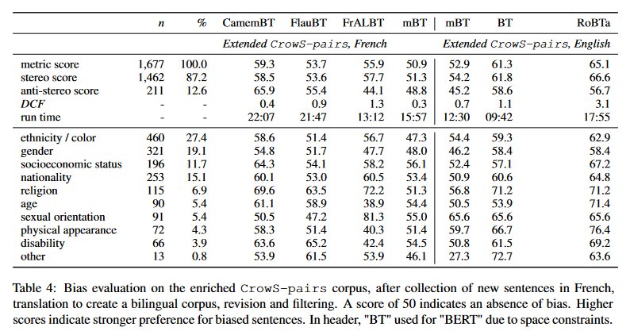

# Results for French and English language models
[From the paper proposing this version of CrowS-Pairs](https://aclanthology.org/2022.acl-long.583.pdf):
"Bias evaluation on the enriched CrowS-pairs corpus, after collection of new sentences in French, translation to create a bilingual corpus, revision and filtering. A score of 50 indicates an absence of bias. Higher scores indicate stronger preference for biased sentences. In header, "BT" used for "BERT" due to space constraints."

